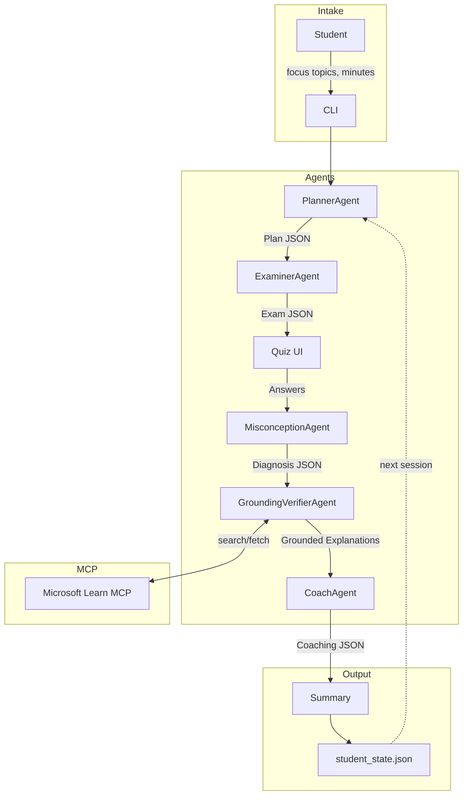

# MDT — Misconception-Driven Tutor

> **AZ-900 Certification Prep** • Multi-agent system powered by Microsoft Foundry

An Agents League "Reasoning Agents" submission that helps students prepare for the Microsoft AZ-900 exam by **diagnosing misconceptions** — not just scoring answers — using a planner–executor + critic/verifier + reflection loop, grounded with Microsoft Learn MCP.

## Repo Overview

- **Multi-agent architecture**: PlannerAgent → ExaminerAgent → MisconceptionAgent → GroundingVerifierAgent → CoachAgent
- **Misconception taxonomy**: 8 defined categories (SRM, IDAM, REGION, PRICING, GOV, SEC, SERVICE_SCOPE, TERMS)
- **MCP grounding**: GroundingVerifierAgent uses Microsoft Learn docs via MCPTool with strict allow-listing
- **Persistent state**: local JSON for CLI, Azure Blob-backed state for hosted API mode
- **Offline mode**: Full stub outputs for testing without API calls
- **Schema-validated**: All agent communication uses Pydantic-enforced JSON schemas
- **Hosted API**: FastAPI endpoints for Azure App Service deployment

## Architecture



## Quick Start

```bash
# Clone & setup
python -m venv .venv
source .venv/bin/activate     # Windows: .venv\Scripts\activate
pip install -r requirements.txt

# Run in offline mode (no Azure credentials needed)
python -m src.main --offline

# Run with Foundry (requires .env configuration)
cp .env.example .env
# Edit .env with your Azure AI Foundry credentials
python -m src.main
```

## Run As API (Local)

```bash
# Start HTTP API
uvicorn src.api:app --reload --port 8000

# Health check
curl http://127.0.0.1:8000/healthz
```

Example session calls:

```bash
# 1) Start session (returns plan + exam)
START_JSON="$(curl -sS -X POST http://127.0.0.1:8000/v1/session/start \
  -H 'Content-Type: application/json' \
  -d '{
    "user_id": "alice",
    "focus_topics": ["Security", "Cloud Concepts"],
    "minutes": 25,
    "offline": true
  }')"

# 2) Submit answers (send back exam from step 1 + answers)
EXAM_JSON="$(echo "$START_JSON" | jq '.exam')"

curl -sS -X POST http://127.0.0.1:8000/v1/session/submit \
  -H 'Content-Type: application/json' \
  -d "$(jq -n \
      --arg user_id 'alice' \
      --argjson exam "$EXAM_JSON" \
      '{user_id: $user_id, exam: $exam, answers: {answers: {}}, offline: true}')"
```

## Environment Variables

| Variable | Required | Description |
|----------|----------|-------------|
| `AZURE_AI_PROJECT_ENDPOINT` | For online mode | Azure AI Foundry project endpoint |
| `AZURE_AI_MODEL_DEPLOYMENT_NAME` | For online mode | Model deployment name (e.g., `gpt-4o`) |
| `MCP_PROJECT_CONNECTION_NAME` | Optional | MCP connection name if required |
| `AZURE_STORAGE_CONNECTION_STRING` | Optional | Enables Azure Blob persistence for state/cache |
| `AZURE_STORAGE_CONTAINER` | Optional | Blob container name (default: `mdt-data`) |
| `STATE_BLOB_PREFIX` | Optional | Blob prefix for student state (default: `state`) |
| `CACHE_BLOB_NAME` | Optional | Blob path for cache JSON (default: `cache/cache.json`) |

## Project Structure

```
├── README.md
├── LICENSE                        # MIT
├── requirements.txt
├── Dockerfile                     # Container image for hosted API
├── .dockerignore
├── .gitignore
├── .env.example
├── .github/
│   └── workflows/
│       └── deploy_vm.yml         # CI/CD deploy to Azure VM on push to main
├── scripts/
│   └── azure/
│       ├── deploy_webapp.sh       # Azure App Service deployment
│       ├── deploy_webapp_code.sh  # App Service code-only deployment
│       └── deploy_vm_code.sh      # Azure VM deployment over SSH
├── src/
│   ├── main.py                    # CLI entrypoint
│   ├── api.py                     # FastAPI app entrypoint
│   ├── foundry_client.py          # Azure AI Foundry SDK wrapper
│   ├── agents/
│   │   ├── planner.py             # PlannerAgent
│   │   ├── examiner.py            # ExaminerAgent
│   │   ├── misconception.py       # MisconceptionAgent
│   │   ├── grounding_verifier.py  # GroundingVerifierAgent + MCP
│   │   └── coach.py               # CoachAgent
│   ├── orchestration/
│   │   ├── workflow.py            # End-to-end pipeline
│   │   ├── tool_policy.py         # MCP tool allow-list
│   │   ├── cache.py               # URL-based doc cache (Blob/local)
│   │   └── state_store.py         # Per-user state persistence (Blob/local)
│   ├── models/
│   │   ├── schemas.py             # Pydantic data models
│   │   └── state.py               # Student state persistence
│   └── util/
│       ├── jsonio.py              # JSON I/O + defensive parsing
│       └── console.py             # Rich CLI formatting
├── eval/
│   ├── offline_cases.jsonl        # Test cases
│   ├── test_offline_eval.py       # Offline test harness (pytest)
│   ├── test_api_eval.py           # API endpoint smoke tests
│   └── online_eval_stub.py        # Online evaluation placeholder
└── docs/
    ├── architecture.md            # Detailed architecture docs
    └── demo.md                    # 90-second demo script
```

## Running Tests

```bash
# Run offline evaluation (no API calls)
pytest eval/test_offline_eval.py -v
```

## Deploy To Azure App Service

1. Set deployment variables in your shell:
   - `RESOURCE_GROUP`, `LOCATION`, `ACR_NAME`, `APP_SERVICE_PLAN`, `WEBAPP_NAME`
   - `AZURE_AI_PROJECT_ENDPOINT`, `AZURE_AI_MODEL_DEPLOYMENT_NAME`
   - Optional: `MCP_PROJECT_CONNECTION_NAME`, `AZURE_STORAGE_CONNECTION_STRING`
2. Run deployment:

```bash
bash scripts/azure/deploy_webapp.sh
```

After deployment, your API health endpoint is:

```text
https://<WEBAPP_NAME>.azurewebsites.net/healthz
```

## Deploy To Azure VM

Manual deploy from your machine:

```bash
export VM_HOST=<your-vm-ip-or-dns>
export VM_USER=azureuser
export HEALTHCHECK_URL=https://<your-domain>/healthz
bash scripts/azure/deploy_vm_code.sh
```

Optional overrides:

- `VM_PORT` (default `22`)
- `APP_DIR` (default `/home/<VM_USER>/app`)
- `SERVICE_NAME` (default `mdt-api`)

## GitHub Actions CI/CD To VM

Workflow file: `.github/workflows/deploy_vm.yml`

It runs on push to `main` and:

1. Installs dependencies
2. Runs `pytest -q`
3. Deploys code to the VM
4. Restarts `mdt-api`
5. Runs a health check (if configured)

Set these repository secrets:

- `VM_HOST` (required)
- `VM_SSH_PRIVATE_KEY` (required; private key matching VM `authorized_keys`)
- `VM_USER` (optional, default `azureuser`)
- `VM_PORT` (optional, default `22`)
- `VM_APP_DIR` (optional, default `/home/<VM_USER>/app`)
- `VM_SERVICE_NAME` (optional, default `mdt-api`)
- `HEALTHCHECK_URL` (optional, recommended)

Example health check URL:

```text
https://<your-domain>/healthz
```

## Safety & Security

| Concern | Mitigation |
|---------|-----------|
| **Secrets** | `.env` in `.gitignore`; `.env.example` provided |
| **Tool allow-listing** | Only `microsoft_docs_search` and `microsoft_docs_fetch` permitted |
| **Citation grounding** | Every explanation requires ≥1 citation; fallback: "Insufficient evidence" |
| **Schema validation** | Pydantic enforces JSON contracts between all agents |
| **Rate limiting** | Disk-backed URL cache; quiz capped at 12 questions |
| **Defensive parsing** | JSON extraction handles markdown fences, retries on non-JSON |

## MCP Grounding

The GroundingVerifierAgent attempts Microsoft Learn grounding via MCP tools when
the active Foundry SDK/runtime exposes MCP tool execution:

1. **Search**: Finds relevant docs using `microsoft_docs_search`
2. **Fetch**: Retrieves content using `microsoft_docs_fetch`
3. **Cache**: Stores fetched docs in `cache.json` by URL
4. **Verify**: Every claim must have a citation (title, `learn.microsoft.com` URL, ≤20-word snippet)
5. **Fallback**: Returns "Insufficient evidence" if tool execution or output validation fails

Tool policy is enforced through an allow-list and approval handler before each MCP call.

## Demo

See [docs/demo.md](docs/demo.md) for a 90-second walkthrough.

## License

MIT — see [LICENSE](LICENSE).
