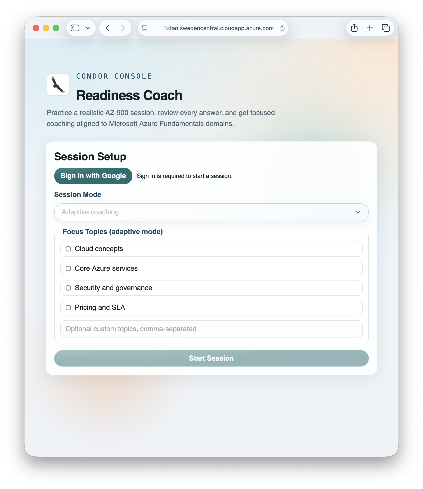
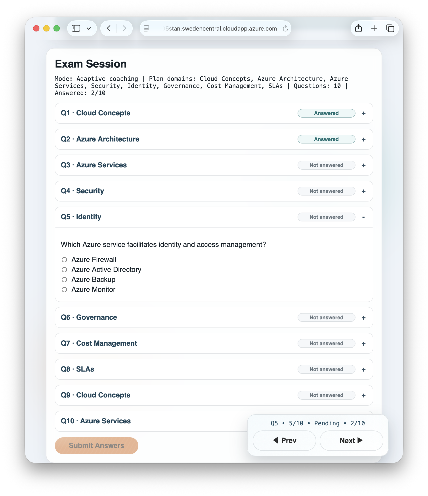
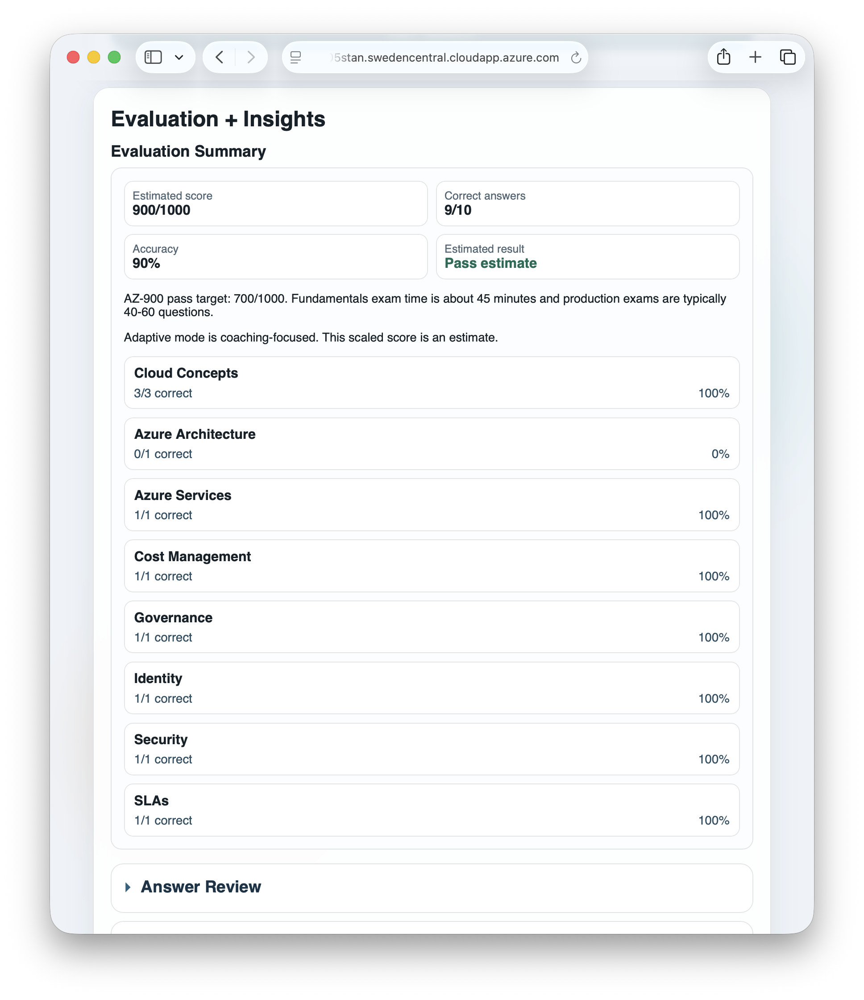
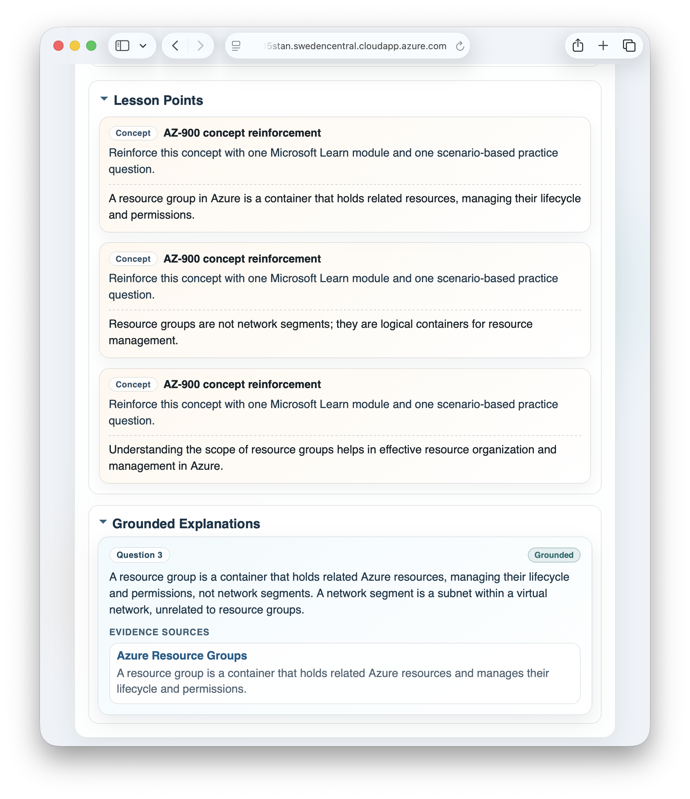
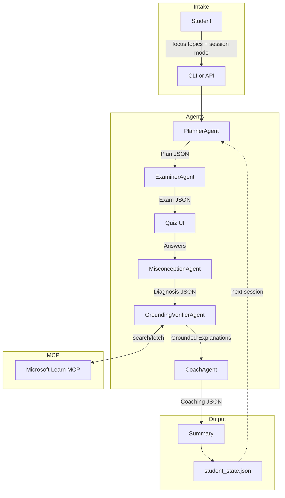

# Condor Console

[](https://github.com/microsoft/agentsleague)
[](https://github.com/microsoft/agentsleague/issues/38)
[](https://github.com/alanmaizon/reasoning-agents/actions/workflows/deploy_vm.yml)
[](https://www.python.org/)
[](https://fastapi.tiangolo.com/)
[](LICENSE)

> **AZ-900 Certification Prep** • Multi-agent system powered by Microsoft Foundry
> Challenge project for Microsoft Agents League, focused on reliable multi-agent reasoning for AZ-900 coaching.

An Agents League "Reasoning Agents" submission that helps students prepare for the Microsoft AZ-900 exam by **diagnosing misconceptions** — not just scoring answers — using a planner–executor + critic/verifier + reflection loop, grounded with Microsoft Learn MCP.

## Repo Overview

- **Multi-agent architecture**: PlannerAgent → ExaminerAgent → MisconceptionAgent → GroundingVerifierAgent → CoachAgent
- **Misconception taxonomy**: 8 defined categories (SRM, IDAM, REGION, PRICING, GOV, SEC, SERVICE_SCOPE, TERMS)
- **MCP grounding**: GroundingVerifierAgent uses Microsoft Learn docs via MCPTool with strict allow-listing
- **Persistent state**: local JSON for CLI, Azure Blob-backed state for hosted API mode
- **Offline mode**: Full stub outputs for testing without API calls
- **Mock test mode**: Randomized 40-60 question exams sampled from a larger AZ-900 bank
- **Mock submit fast path**: `mock_test` submit returns score-focused evaluation without grounding/coaching stages
- **Adaptive insights UX**: Collapsible Answer Review, Misconceptions, Lesson Points, and Grounded Explanations
- **Schema-validated**: All agent communication uses Pydantic-enforced JSON schemas
- **Hosted API**: FastAPI endpoints for Azure App Service deployment

## AZ-900 Exam Snapshot (Official)

- Passing score: **700/1000**
- Fundamentals exam duration: **45 minutes** exam time (with **65-minute** seat time)
- Typical Microsoft certification item volume: **40-60 questions** (exact AZ-900 count can vary)

Current skill distribution:
1. Describe cloud concepts (25-30%)
2. Describe Azure architecture and services (35-40%)
3. Describe Azure management and governance (30-35%)

References:
- https://learn.microsoft.com/en-us/credentials/certifications/azure-fundamentals/
- https://learn.microsoft.com/en-us/credentials/support/exam-duration-exam-experience
- https://learn.microsoft.com/en-us/credentials/certifications/resources/study-guides/az-900

## App Snapshots

[Demo Video (Vimeo)](https://vimeo.com/1167717294?share=copy&fl=sv&fe=ci)






## Architecture



## Quick Start

```bash
# Clone & setup
python -m venv .venv
source .venv/bin/activate     # Windows: .venv\Scripts\activate
pip install -r requirements.txt

# Run in offline mode (no Azure credentials needed)
python -m src.main --offline

# Run with Foundry (requires .env configuration)
cp .env.example .env
# Edit .env with your Azure AI Foundry credentials
python -m src.main
```

If your shell maps `python`/`pip` differently, use `python3` and `pip3` instead.

## Run As API (Local)

```bash
# Start HTTP API
uvicorn src.api:app --reload --port 8000

# Health check
curl http://127.0.0.1:8000/healthz

# Open built-in frontend
open http://127.0.0.1:8000/
```

Example session calls:

```bash
# 1) Start session (returns plan + exam)
START_JSON="$(curl -sS -X POST http://127.0.0.1:8000/v1/session/start \
  -H 'Content-Type: application/json' \
  -d '{
    "user_id": "alice",
    "mode": "adaptive",
    "focus_topics": ["Security", "Cloud Concepts"],
    "offline": true
  }')"

# 2) Submit answers (send back exam from step 1 + answers)
EXAM_JSON="$(echo "$START_JSON" | jq '.exam')"

curl -sS -X POST http://127.0.0.1:8000/v1/session/submit \
  -H 'Content-Type: application/json' \
  -d "$(jq -n \
      --arg user_id 'alice' \
      --argjson exam "$EXAM_JSON" \
      '{user_id: $user_id, mode: "adaptive", exam: $exam, answers: {answers: {}}, offline: true}')"
```

Submit behavior by mode:
- `adaptive`: full diagnosis + grounding + coaching pipeline
- `mock_test`: evaluation-only scoring path for faster result turnaround

## Configuration

Core variables for online mode:

- `AZURE_AI_PROJECT_ENDPOINT`
- `AZURE_AI_MODEL_DEPLOYMENT_NAME`

Optional features:

- Entra auth (`ENTRA_*`, `FRONTEND_*`)
- Rate limiting (`API_RATE_LIMIT_*`)
- Persistence backends (`POSTGRES_*`, `AZURE_STORAGE_*`, `STATE_DIR`)
- MCP connection (`MCP_PROJECT_CONNECTION_NAME`)

Use `.env.example` as the source of truth for available variables and placeholders.

## Project Structure (high level)

- `src/`: app source (API, agents, orchestration, frontend)
- `eval/`: automated tests
- `scripts/`: deployment/security scripts
- `docs/`: architecture, demo, deployment, operations runbook
- `.github/workflows/`: CI/CD workflow definitions

## Running Tests

```bash
pytest -q
bash scripts/security/check_secret_leaks.sh
```

## Optional Cloud Deployment

Cloud hosting is optional for local development and challenge review.

For full deployment steps, see:

- `docs/deployment.md`
- `docs/runbook_ops.md`

Key scripts:

- App Service: `scripts/azure/deploy_webapp.sh`
- VM deploy: `scripts/azure/deploy_vm_code.sh`
- Entra External ID user flow: `scripts/azure/setup_external_id_user_flow.sh`
- Observability: `scripts/azure/setup_observability.sh`

## Safety & Security

| Concern | Mitigation |
|---------|-----------|
| **Secrets** | `.env` in `.gitignore`; `.env.example` provided |
| **API auth** | Optional Entra ID JWT validation on `/v1/*` (issuer, audience, signature, expiry) |
| **Tool allow-listing** | Only read-only Learn MCP tools are permitted (`microsoft_docs_search`, `microsoft_docs_fetch`, `microsoft_code_sample_search`) |
| **Citation grounding** | Every explanation requires ≥1 citation; fallback: "Insufficient evidence" |
| **Schema validation** | Pydantic enforces JSON contracts between all agents |
| **Rate limiting** | Disk-backed URL cache; adaptive quiz targets 8-12 questions and mock mode serves 40-60 |
| **Defensive parsing** | JSON extraction handles markdown fences, retries on non-JSON |

### Secret Hygiene

- Keep real secrets only in runtime environment files (`.env`, `/etc/mdt-api.env`, GitHub Secrets), never in tracked files.
- CI enforces a lightweight leak guard via `scripts/security/check_secret_leaks.sh`.
- Prefer managed identity auth over static API keys when possible.
- Rotate DB credentials periodically and after any suspected exposure.

## MCP Grounding

The GroundingVerifierAgent attempts Microsoft Learn grounding via MCP tools when
the active Foundry SDK/runtime exposes MCP tool execution:

1. **Search**: Finds relevant docs using `microsoft_docs_search`
2. **Code Samples**: Augments evidence with `microsoft_code_sample_search` when available
3. **Fetch**: Retrieves content using `microsoft_docs_fetch`
4. **Cache**: Stores fetched docs in `cache.json` by URL
5. **Verify**: Every claim must have a citation (title, `learn.microsoft.com` URL, ≤20-word snippet)
6. **Fallback**: Returns "Insufficient evidence" if tool execution or output validation fails

Tool policy is enforced through an allow-list and approval handler before each MCP call.
When runtime tool discovery is available, the agent prefers discovered tools rather
than assuming every tool is present.

## Demo

See [docs/demo.md](docs/demo.md) for a 90-second walkthrough.

## License

MIT — see [LICENSE](LICENSE).
