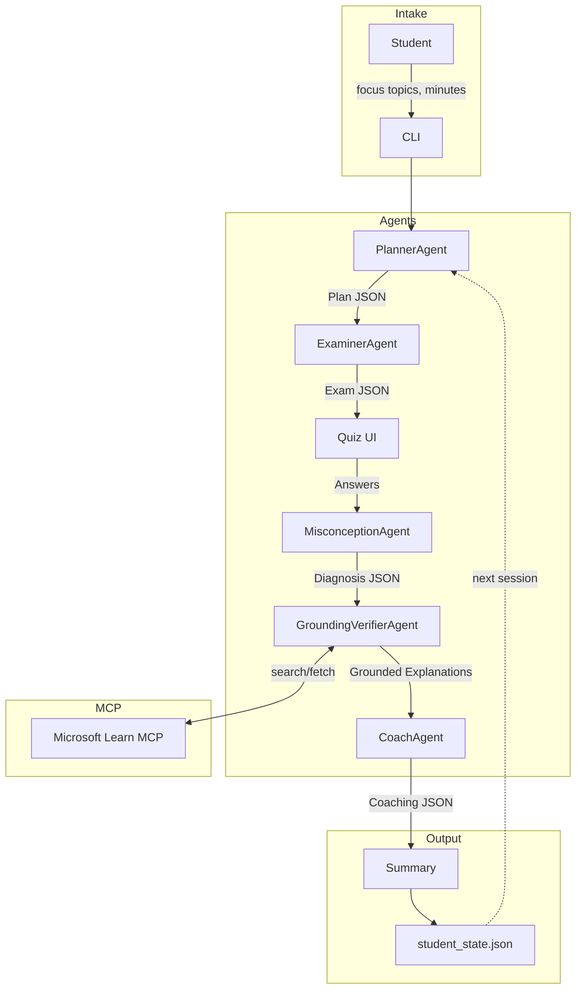

# MDT — Misconception-Driven Tutor

> **AZ-900 Certification Prep** • Multi-agent system powered by Microsoft Foundry

An Agents League "Reasoning Agents" submission that helps students prepare for the Microsoft AZ-900 exam by **diagnosing misconceptions** — not just scoring answers — using a planner–executor + critic/verifier + reflection loop, grounded with Microsoft Learn MCP.

## Repo Overview

- **Multi-agent architecture**: PlannerAgent → ExaminerAgent → MisconceptionAgent → GroundingVerifierAgent → CoachAgent
- **Misconception taxonomy**: 8 defined categories (SRM, IDAM, REGION, PRICING, GOV, SEC, SERVICE_SCOPE, TERMS)
- **MCP grounding**: GroundingVerifierAgent uses Microsoft Learn docs via MCPTool with strict allow-listing
- **Persistent state**: `student_state.json` tracks domain scores & misconceptions across sessions
- **Offline mode**: Full stub outputs for testing without API calls
- **Schema-validated**: All agent communication uses Pydantic-enforced JSON schemas

## Architecture



## Quick Start

```bash
# Clone & setup
python -m venv .venv
source .venv/bin/activate     # Windows: .venv\Scripts\activate
pip install -r requirements.txt

# Run in offline mode (no Azure credentials needed)
python -m src.main --offline

# Run with Foundry (requires .env configuration)
cp .env.example .env
# Edit .env with your Azure AI Foundry credentials
python -m src.main
```

## Environment Variables

| Variable | Required | Description |
|----------|----------|-------------|
| `AZURE_AI_PROJECT_ENDPOINT` | For online mode | Azure AI Foundry project endpoint |
| `AZURE_AI_MODEL_DEPLOYMENT_NAME` | For online mode | Model deployment name (e.g., `gpt-4o`) |
| `MCP_PROJECT_CONNECTION_NAME` | Optional | MCP connection name if required |

## Project Structure

```
├── README.md
├── LICENSE                        # MIT
├── requirements.txt
├── .gitignore
├── .env.example
├── src/
│   ├── main.py                    # CLI entrypoint
│   ├── foundry_client.py          # Azure AI Foundry SDK wrapper
│   ├── agents/
│   │   ├── planner.py             # PlannerAgent
│   │   ├── examiner.py            # ExaminerAgent
│   │   ├── misconception.py       # MisconceptionAgent
│   │   ├── grounding_verifier.py  # GroundingVerifierAgent + MCP
│   │   └── coach.py               # CoachAgent
│   ├── orchestration/
│   │   ├── workflow.py            # End-to-end pipeline
│   │   ├── tool_policy.py         # MCP tool allow-list
│   │   └── cache.py               # URL-based doc cache
│   ├── models/
│   │   ├── schemas.py             # Pydantic data models
│   │   └── state.py               # Student state persistence
│   └── util/
│       ├── jsonio.py              # JSON I/O + defensive parsing
│       └── console.py             # Rich CLI formatting
├── eval/
│   ├── offline_cases.jsonl        # Test cases
│   ├── test_offline_eval.py       # Offline test harness (pytest)
│   └── online_eval_stub.py        # Online evaluation placeholder
└── docs/
    ├── architecture.md            # Detailed architecture docs
    └── demo.md                    # 90-second demo script
```

## Running Tests

```bash
# Run offline evaluation (no API calls)
pytest eval/test_offline_eval.py -v
```

## Safety & Security

| Concern | Mitigation |
|---------|-----------|
| **Secrets** | `.env` in `.gitignore`; `.env.example` provided |
| **Tool allow-listing** | Only `microsoft_docs_search` and `microsoft_docs_fetch` permitted |
| **Citation grounding** | Every explanation requires ≥1 citation; fallback: "Insufficient evidence" |
| **Schema validation** | Pydantic enforces JSON contracts between all agents |
| **Rate limiting** | Disk-backed URL cache; quiz capped at 12 questions |
| **Defensive parsing** | JSON extraction handles markdown fences, retries on non-JSON |

## MCP Grounding

The GroundingVerifierAgent integrates with Microsoft Learn via MCP:

1. **Search**: Finds relevant docs using `microsoft_docs_search`
2. **Fetch**: Retrieves content using `microsoft_docs_fetch`
3. **Cache**: Stores fetched docs in `cache.json` by URL
4. **Verify**: Every claim must have a citation (title, URL, ≤20-word snippet)
5. **Fallback**: Returns "Insufficient evidence" if no citations available

Tool approval uses `require_approval="always"` with auto-approve only for allow-listed tools.

## Demo

See [docs/demo.md](docs/demo.md) for a 90-second walkthrough.

## License

MIT — see [LICENSE](LICENSE).
