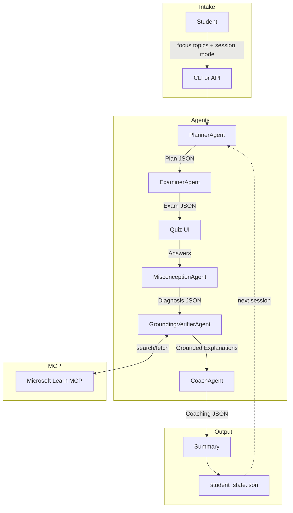

# Condor — AZ-900 Reasoning Tutor

> **AZ-900 Certification Prep** • Multi-agent system powered by Microsoft Foundry

An Agents League "Reasoning Agents" submission that helps students prepare for the Microsoft AZ-900 exam by **diagnosing misconceptions** — not just scoring answers — using a planner–executor + critic/verifier + reflection loop, grounded with Microsoft Learn MCP.

## Repo Overview

- **Multi-agent architecture**: PlannerAgent → ExaminerAgent → MisconceptionAgent → GroundingVerifierAgent → CoachAgent
- **Misconception taxonomy**: 8 defined categories (SRM, IDAM, REGION, PRICING, GOV, SEC, SERVICE_SCOPE, TERMS)
- **MCP grounding**: GroundingVerifierAgent uses Microsoft Learn docs via MCPTool with strict allow-listing
- **Persistent state**: local JSON for CLI, Azure Blob-backed state for hosted API mode
- **Offline mode**: Full stub outputs for testing without API calls
- **Mock test mode**: Randomized 40-60 question exams sampled from a larger AZ-900 bank
- **Schema-validated**: All agent communication uses Pydantic-enforced JSON schemas
- **Hosted API**: FastAPI endpoints for Azure App Service deployment

## AZ-900 Exam Snapshot (Official)

- Passing score: **700/1000**
- Fundamentals exam duration: **45 minutes** exam time (with **65-minute** seat time)
- Typical Microsoft certification item volume: **40-60 questions** (exact AZ-900 count can vary)

Current skill distribution:
1. Describe cloud concepts (25-30%)
2. Describe Azure architecture and services (35-40%)
3. Describe Azure management and governance (30-35%)

References:
- https://learn.microsoft.com/en-us/credentials/certifications/azure-fundamentals/
- https://learn.microsoft.com/en-us/credentials/support/exam-duration-exam-experience
- https://learn.microsoft.com/en-us/credentials/certifications/resources/study-guides/az-900

## Architecture



## Quick Start

```bash
# Clone & setup
python -m venv .venv
source .venv/bin/activate     # Windows: .venv\Scripts\activate
pip install -r requirements.txt

# Run in offline mode (no Azure credentials needed)
python -m src.main --offline

# Run with Foundry (requires .env configuration)
cp .env.example .env
# Edit .env with your Azure AI Foundry credentials
python -m src.main
```

## Run As API (Local)

```bash
# Start HTTP API
uvicorn src.api:app --reload --port 8000

# Health check
curl http://127.0.0.1:8000/healthz

# Open built-in frontend
open http://127.0.0.1:8000/
```

Example session calls:

```bash
# 1) Start session (returns plan + exam)
START_JSON="$(curl -sS -X POST http://127.0.0.1:8000/v1/session/start \
  -H 'Content-Type: application/json' \
  -d '{
    "user_id": "alice",
    "mode": "adaptive",
    "focus_topics": ["Security", "Cloud Concepts"],
    "offline": true
  }')"

# 2) Submit answers (send back exam from step 1 + answers)
EXAM_JSON="$(echo "$START_JSON" | jq '.exam')"

curl -sS -X POST http://127.0.0.1:8000/v1/session/submit \
  -H 'Content-Type: application/json' \
  -d "$(jq -n \
      --arg user_id 'alice' \
      --argjson exam "$EXAM_JSON" \
      '{user_id: $user_id, exam: $exam, answers: {answers: {}}, offline: true}')"
```

## Environment Variables

| Variable | Required | Description |
|----------|----------|-------------|
| `AZURE_AI_PROJECT_ENDPOINT` | For online mode | Azure AI Foundry project endpoint |
| `AZURE_AI_MODEL_DEPLOYMENT_NAME` | For online mode | Model deployment name (e.g., `gpt-4o`) |
| `APP_LOG_LEVEL` | Optional | Runtime log level (default: `INFO`) |
| `APP_LOG_FORMAT` | Optional | `json` (default) or `plain` |
| `ENTRA_AUTH_ENABLED` | Optional | Enables Microsoft Entra ID bearer token auth on `/v1/*` routes |
| `ENTRA_TENANT_ID` | Required if auth enabled | Entra tenant ID used for OpenID metadata discovery |
| `ENTRA_AUDIENCE` / `ENTRA_AUDIENCES` | Required if auth enabled | Accepted token audience(s), comma-separated |
| `ENTRA_REQUIRED_SCOPES` | Optional | Required delegated scopes, comma-separated |
| `ENTRA_REQUIRED_ROLES` | Optional | Required app roles, comma-separated |
| `ENTRA_ISSUER` / `ENTRA_ISSUERS` | Optional | Override allowed issuer(s), comma-separated when multiple |
| `ENTRA_JWKS_URI` | Optional | Override JWKS endpoint URL |
| `FRONTEND_CLIENT_ID` | Recommended when auth enabled | SPA app registration client ID used by built-in frontend |
| `FRONTEND_AUTHORITY` | Optional | Frontend authority URL (default derives from `ENTRA_TENANT_ID`) |
| `FRONTEND_API_SCOPE` | Recommended when auth enabled | Scope requested by frontend (e.g. `api://<api-app-id>/api.access`) |
| `MCP_PROJECT_CONNECTION_NAME` | Optional | MCP connection name if required |
| `POSTGRES_DSN` / `DATABASE_URL` | Optional | PostgreSQL DSN for primary state persistence |
| `POSTGRES_HOST`, `POSTGRES_PORT`, `POSTGRES_DB`, `POSTGRES_USER`, `POSTGRES_PASSWORD`, `POSTGRES_SSLMODE` | Optional | PostgreSQL discrete connection settings (used when DSN is absent) |
| `STATE_PG_TABLE` | Optional | PostgreSQL table name for user state (default: `student_state`) |
| `AZURE_STORAGE_CONNECTION_STRING` | Optional | Enables Azure Blob fallback for state/cache |
| `AZURE_STORAGE_CONTAINER` | Optional | Blob container name (default: `mdt-data`) |
| `STATE_BLOB_PREFIX` | Optional | Blob prefix for student state (default: `state`) |
| `CACHE_BLOB_NAME` | Optional | Blob path for cache JSON (default: `cache/cache.json`) |
| `STATE_DIR` | Optional | Local fallback state directory (default: `.data/state`) |

State persistence priority in hosted mode:
- PostgreSQL (if configured)
- Azure Blob Storage (if configured)
- Local disk fallback (`STATE_DIR`)

Authentication behavior:
- `/healthz` stays public
- `/v1/*` is protected only when `ENTRA_AUTH_ENABLED=true`
- `/` serves the built-in frontend shell

## Project Structure

```
├── README.md
├── LICENSE                        # MIT
├── requirements.txt
├── Dockerfile                     # Container image for hosted API
├── .dockerignore
├── .gitignore
├── .env.example
├── .github/
│   └── workflows/
│       └── deploy_vm.yml         # CI/CD deploy to Azure VM on push to main
├── scripts/
│   ├── azure/
│   │   ├── deploy_webapp.sh       # Azure App Service deployment
│   │   ├── deploy_webapp_code.sh  # App Service code-only deployment
│   │   ├── deploy_vm_code.sh      # Azure VM deployment over SSH
│   │   └── setup_observability.sh # Azure Monitor + alert setup for VM
│   └── security/
│       └── check_secret_leaks.sh  # Tracked-file secret leak guard
├── src/
│   ├── main.py                    # CLI entrypoint
│   ├── api.py                     # FastAPI app entrypoint
│   ├── foundry_client.py          # Azure AI Foundry SDK wrapper
│   ├── agents/
│   │   ├── planner.py             # PlannerAgent
│   │   ├── examiner.py            # ExaminerAgent
│   │   ├── misconception.py       # MisconceptionAgent
│   │   ├── grounding_verifier.py  # GroundingVerifierAgent + MCP
│   │   └── coach.py               # CoachAgent
│   ├── orchestration/
│   │   ├── workflow.py            # End-to-end pipeline
│   │   ├── tool_policy.py         # MCP tool allow-list
│   │   ├── cache.py               # URL-based doc cache (Blob/local)
│   │   └── state_store.py         # Per-user state persistence (Postgres/Blob/local)
│   ├── models/
│   │   ├── schemas.py             # Pydantic data models
│   │   └── state.py               # Student state persistence
│   ├── web/
│   │   ├── index.html             # Built-in frontend shell
│   │   ├── app.js                 # Frontend logic + API calls
│   │   └── styles.css             # Frontend styles
│   └── util/
│       ├── jsonio.py              # JSON I/O + defensive parsing
│       └── console.py             # Rich CLI formatting
├── eval/
│   ├── offline_cases.jsonl        # Test cases
│   ├── test_offline_eval.py       # Offline test harness (pytest)
│   ├── test_api_eval.py           # API endpoint smoke tests
│   └── online_eval_stub.py        # Online evaluation placeholder
└── docs/
    ├── architecture.md            # Detailed architecture docs
    ├── runbook_ops.md             # Start/stop/recovery operations runbook
    └── demo.md                    # 90-second demo script
```

## Running Tests

```bash
# Run offline evaluation (no API calls)
pytest eval/test_offline_eval.py -v
```

## Deploy To Azure App Service

1. Set deployment variables in your shell:
   - `RESOURCE_GROUP`, `LOCATION`, `ACR_NAME`, `APP_SERVICE_PLAN`, `WEBAPP_NAME`
   - `AZURE_AI_PROJECT_ENDPOINT`, `AZURE_AI_MODEL_DEPLOYMENT_NAME`
   - Optional: `MCP_PROJECT_CONNECTION_NAME`, PostgreSQL vars, `AZURE_STORAGE_CONNECTION_STRING`
2. Run deployment:

```bash
bash scripts/azure/deploy_webapp.sh
```

After deployment, your API health endpoint is:

```text
https://<WEBAPP_NAME>.azurewebsites.net/healthz
```

## Deploy To Azure VM

Manual deploy from your machine:

```bash
export VM_HOST=<your-vm-ip-or-dns>
export VM_USER=azureuser
export HEALTHCHECK_URL=https://<your-domain>/healthz
bash scripts/azure/deploy_vm_code.sh
```

Optional overrides:

- `VM_PORT` (default `22`)
- `APP_DIR` (default `/home/<VM_USER>/app`)
- `SERVICE_NAME` (default `mdt-api`)

## GitHub Actions CI/CD To VM

Workflow file: `.github/workflows/deploy_vm.yml`

It now runs with:

1. `pull_request` to `main`: CI only (install, leak guard, tests)
2. `push` to `main`: CI, then deploy to VM
3. `workflow_dispatch`: CI, then deploy to VM (manual run)

Deployment job details:

1. Configures SSH key from GitHub secret
2. Uploads repository package to VM
3. Restarts `mdt-api` service
4. Runs health check if `HEALTHCHECK_URL` is set

Set these repository secrets:

- `VM_HOST` (required)
- `VM_SSH_PRIVATE_KEY` (required; private key matching VM `authorized_keys`)
- `VM_USER` (optional, default `azureuser`)
- `VM_PORT` (optional, default `22`)
- `VM_APP_DIR` (optional, default `/home/<VM_USER>/app`)
- `VM_SERVICE_NAME` (optional, default `mdt-api`)
- `HEALTHCHECK_URL` (optional, recommended)

Example health check URL:

```text
https://<your-domain>/healthz
```

Recommended:

- Create GitHub Environment `production` and place deploy secrets there.
- Add required reviewer approval on `production` if you want protected deploys.

## Observability Setup (VM)

```bash
export RESOURCE_GROUP=<resource-group>
export LOCATION=swedencentral
export VM_NAME=<vm-name>
export HEALTHCHECK_URL=https://<your-domain>/healthz
export ALERT_EMAIL=<your-email>
bash scripts/azure/setup_observability.sh
```

This provisions:
- Log Analytics workspace
- Application Insights component + health web test
- Azure Monitor Agent + data collection rule on VM
- Action group + baseline alerts

Operations runbook: `docs/runbook_ops.md`

## Safety & Security

| Concern | Mitigation |
|---------|-----------|
| **Secrets** | `.env` in `.gitignore`; `.env.example` provided |
| **API auth** | Optional Entra ID JWT validation on `/v1/*` (issuer, audience, signature, expiry) |
| **Tool allow-listing** | Only read-only Learn MCP tools are permitted (`microsoft_docs_search`, `microsoft_docs_fetch`, `microsoft_code_sample_search`) |
| **Citation grounding** | Every explanation requires ≥1 citation; fallback: "Insufficient evidence" |
| **Schema validation** | Pydantic enforces JSON contracts between all agents |
| **Rate limiting** | Disk-backed URL cache; adaptive quiz targets 8-12 questions and mock mode serves 40-60 |
| **Defensive parsing** | JSON extraction handles markdown fences, retries on non-JSON |

### Secret Hygiene

- Keep real secrets only in runtime environment files (`.env`, `/etc/mdt-api.env`, GitHub Secrets), never in tracked files.
- CI enforces a lightweight leak guard via `scripts/security/check_secret_leaks.sh`.
- Prefer managed identity auth over static API keys when possible.
- Rotate DB credentials periodically and after any suspected exposure.

## MCP Grounding

The GroundingVerifierAgent attempts Microsoft Learn grounding via MCP tools when
the active Foundry SDK/runtime exposes MCP tool execution:

1. **Search**: Finds relevant docs using `microsoft_docs_search`
2. **Code Samples**: Augments evidence with `microsoft_code_sample_search` when available
3. **Fetch**: Retrieves content using `microsoft_docs_fetch`
4. **Cache**: Stores fetched docs in `cache.json` by URL
5. **Verify**: Every claim must have a citation (title, `learn.microsoft.com` URL, ≤20-word snippet)
6. **Fallback**: Returns "Insufficient evidence" if tool execution or output validation fails

Tool policy is enforced through an allow-list and approval handler before each MCP call.
When runtime tool discovery is available, the agent prefers discovered tools rather
than assuming every tool is present.

## Demo

See [docs/demo.md](docs/demo.md) for a 90-second walkthrough.

## License

MIT — see [LICENSE](LICENSE).
