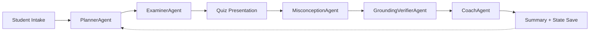

# Architecture — MDT (Misconception-Driven Tutor)

## Agents

| Agent | Role | Input | Output |
|-------|------|-------|--------|
| **PlannerAgent** | Chooses domains + question mix based on student state | StudentState, focus topics | Plan JSON |
| **ExaminerAgent** | Generates adaptive diagnostic quiz | Plan | Exam JSON (8-12 Qs) |
| **MisconceptionAgent** | Classifies errors into taxonomy, ranks misconceptions | Exam + StudentAnswerSheet | Diagnosis JSON |
| **GroundingVerifierAgent** | Grounds explanations with Microsoft Learn citations | Question + DiagnosisResult | GroundedExplanation JSON |
| **CoachAgent** | Generates remediation lessons + micro-drills | Diagnosis + GroundedExplanations | Coaching JSON |

## Data Flow

## Misconception Taxonomy

| ID | Description |
|----|-------------|
| SRM | Shared responsibility confusion |
| IDAM | Identity/auth confusion (Entra ID vs RBAC) |
| REGION | Region vs Availability Zone vs geography |
| PRICING | Pricing meters, billing, TCO confusion |
| GOV | Governance (policy, management groups, tagging) |
| SEC | Security services/features confusion |
| SERVICE_SCOPE | IaaS/PaaS/SaaS misunderstanding |
| TERMS | Vocabulary mismatch / unclear understanding fallback |

## Tool Policy

The `GroundingVerifierAgent` uses Microsoft Learn MCP for citation grounding.

**Allow-list** (read-only):
- `microsoft_docs_search` — search Learn documentation
- `microsoft_docs_fetch` — fetch a specific Learn page

All other tool requests are **denied** with a reason message.

Before each tool call, policy checks both allow-list membership and approval handler.
If MCP execution is unavailable in the active SDK/runtime, grounding falls back to
an "Insufficient evidence" response with a placeholder Learn citation.

## Caching

Fetched docs are cached by URL in `cache.json` (disk-backed) to:
- Reduce redundant API calls
- Provide basic rate-limit/cost protection
- Speed up repeated queries

## Reasoning Patterns

1. **Planner–Executor**: PlannerAgent creates strategy; ExaminerAgent executes it
2. **Critic/Verifier**: GroundingVerifierAgent validates every claim with citations
3. **Reflection Loop**: Student state persists across sessions; PlannerAgent adapts based on prior misconceptions

## Security

- Secrets stored in `.env` (never committed; `.gitignore` enforced)
- Tool allow-listing prevents unauthorized MCP tool use
- JSON-only communication between agents (schema-validated with Pydantic)
- Citation grounding prevents hallucinated explanations
- Fallback: "Insufficient evidence" when citations unavailable
